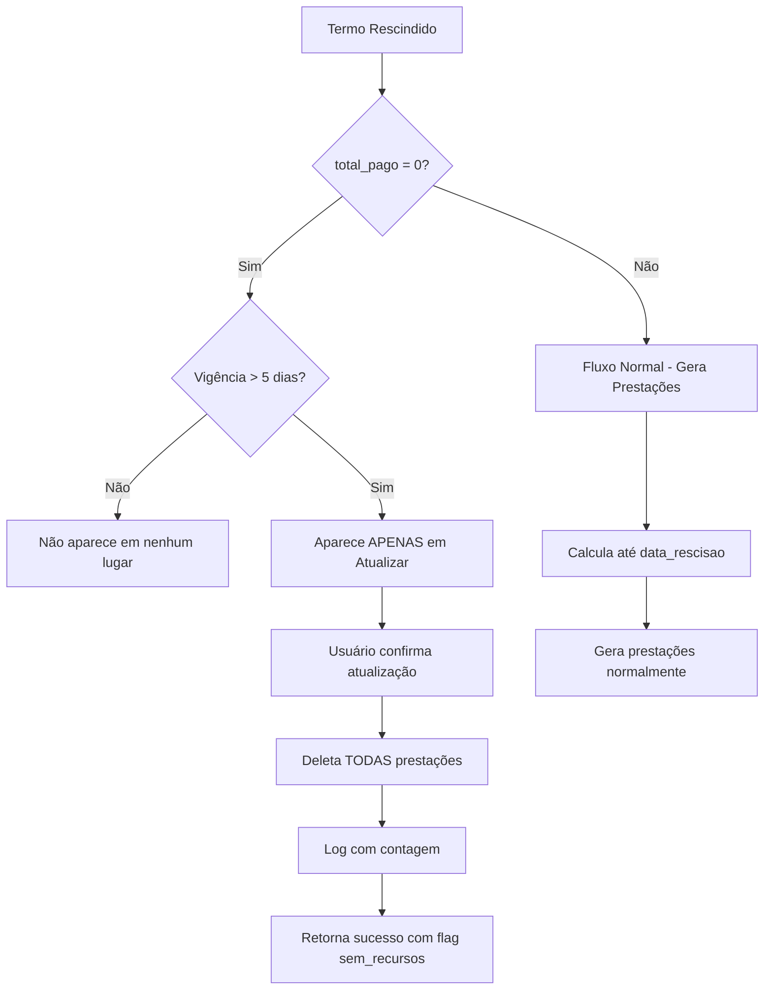

# Regra de Negócio: Termos Rescindidos Sem Recursos (total_pago = 0)

## 📋 Contexto

Termos rescindidos que **não receberam recursos** (`total_pago = 0`) não devem gerar prestações de contas, independentemente do tempo de vigência, pois não houve execução financeira.

## 🎯 Regras Implementadas

### 1. **Adicionar Análises** - Bloqueio Preventivo
**Comportamento:** ❌ Termo NÃO aparece na lista

**Condições para exclusão:**
```sql
AND NOT (tr.data_rescisao IS NOT NULL AND COALESCE(p.total_pago, 0) = 0)
```

**Exemplo:**
- Termo: TFM/001/2024
- Vigência: 01/01/2024 a 31/12/2024 (1 ano)
- Rescindido: 31/01/2024 (1 mês de vigência, > 5 dias ✅)
- Total Pago: R$ 0,00 ❌
- **Resultado:** Não aparece em "Adicionar Análises"

### 2. **Atualizar Prestações** - Validação Humana com Remoção
**Comportamento:** ✅ Termo APARECE para revisão, mas ao atualizar remove TODAS as prestações

**Fluxo:**
1. Termo aparece na lista de divergências
2. Mostra alerta vermelho: "SEM RECURSOS REPASSADOS (R$ 0,00)"
3. Aviso: "Ao atualizar, TODAS as prestações deste termo serão REMOVIDAS"
4. Usuário confirma atualização
5. Sistema deleta todas as prestações
6. Retorna mensagem de sucesso com contagem de prestações removidas

**Resposta da API:**
```json
{
  "mensagem": "Termo TFM/001/2024 rescindido sem recursos (R$ 0,00). 2 prestação(ões) removida(s) (incluindo 1 marcada(s) como entregue). Vigência: 30 dia(s).",
  "prestacoes_removidas": 2,
  "prestacoes_entregues": 1,
  "sem_recursos": true
}
```

### 3. **Calcular Prestações (API)** - Validação Adicional
**Comportamento:** ❌ Retorna erro se tentar calcular

**Validação:**
```python
if data_rescisao and total_pago == 0:
    return jsonify({
        'erro': 'Termo foi rescindido sem ter recebido recursos (total pago: R$ 0,00). 
                 Não há prestações de contas a serem geradas, 
                 pois não houve execução financeira.',
        'total_pago': 0
    }), 400
```

## 📊 Comparação: Vigência vs Recursos

| Cenário | Vigência | Rescisão | Total Pago | Adicionar | Atualizar | Resultado |
|---------|----------|----------|------------|-----------|-----------|-----------|
| 1 | 1 ano | 4 dias | R$ 0,00 | ❌ | ❌ | Não aparece (< 5 dias) |
| 2 | 1 ano | 1 mês | R$ 0,00 | ❌ | ✅ Remove | Aparece para limpar prestações |
| 3 | 1 ano | 1 mês | R$ 50.000 | ✅ | ✅ Recalcula | Gera prestações até rescisão |
| 4 | 1 ano | 6 meses | R$ 0,00 | ❌ | ✅ Remove | Mesmo com 6 meses, sem $ = sem PC |

## 🎨 Indicadores Visuais

### Template: atualizar_prestacoes.html

#### Alerta para Termo sem Recursos:
```html

<div class="alert alert-warning mb-3">
  <span class="badge bg-danger mt-2">⚠️ SEM RECURSOS REPASSADOS (R$ 0,00)</span>
  <br>
  <strong class="text-danger mt-2">
    Ao atualizar, TODAS as prestações deste termo serão REMOVIDAS, 
    pois não houve execução financeira.
  </strong>
</div>

```

#### Visualização no Card:
```
┌──────────────────────────────────────────────────┐
│ 📄 TFM/001/2024  [🔴 RESCINDIDO]                 │
├──────────────────────────────────────────────────┤
│ ⚠️ Termo Rescindido!                             │
│ Rescindido em: 31/01/2024                        │
│ ⚠️ SEM RECURSOS REPASSADOS (R$ 0,00)            │
│                                                  │
│ ⚠️ Ao atualizar, TODAS as prestações deste      │
│ termo serão REMOVIDAS, pois não houve           │
│ execução financeira.                            │
├──────────────────────────────────────────────────┤
│ Prestações Cadastradas (2)                       │
│ - Semestral #1: 01/01/2024 até 30/06/2024      │
│ - Final #1: 01/01/2024 até 31/12/2024          │
│                                                  │
│ Prestações Corretas (0)                          │
│ (nenhuma - será removido)                       │
└──────────────────────────────────────────────────┘
```

## 🔧 Implementação Técnica

### Arquivo: routes/analises.py

#### 1. Query em adicionar_analises (GET):
```python
# Linhas ~745-750
AND NOT (tr.data_rescisao IS NOT NULL AND COALESCE(p.total_pago, 0) = 0)
```

#### 2. Validação em calcular_prestacoes (API POST):
```python
# Linhas ~810-825
if data_rescisao and total_pago == 0:
    return jsonify({
        'erro': 'Termo rescindido sem recursos...',
        'total_pago': 0
    }), 400
```

#### 3. Lógica em atualizar_prestacoes (POST):
```python
# Linhas ~1065-1095
if data_rescisao and total_pago == 0:
    # Contar prestações antes de deletar
    cur.execute("""
        SELECT COUNT(*) as total,
               COUNT(CASE WHEN entregue = true THEN 1 END) as entregues
        FROM parcerias_analises
        WHERE numero_termo = %s
    """, (numero_termo,))
    
    contagem = cur.fetchone()
    total_prestacoes = contagem['total']
    prestacoes_entregues = contagem['entregues']
    
    # Deletar todas as prestações
    cur.execute("DELETE FROM parcerias_analises WHERE numero_termo = %s", (numero_termo,))
    
    mensagem = f'{total_prestacoes} prestação(ões) removida(s)'
    if prestacoes_entregues > 0:
        mensagem += f' (incluindo {prestacoes_entregues} marcada(s) como entregue)'
    
    return jsonify({
        'mensagem': mensagem,
        'prestacoes_removidas': total_prestacoes,
        'sem_recursos': True
    }), 200
```

#### 4. Query em atualizar_prestacoes (GET):
```python
# Linhas ~1225-1230
SELECT DISTINCT 
    p.numero_termo,
    p.total_pago,  # ← Campo adicionado
    tr.data_rescisao,
    ...
FROM Parcerias p
```

#### 5. Dados para Template:
```python
# Linhas ~1330-1340
termos_divergentes[numero_termo] = {
    'numero_termo': numero_termo,
    'rescindido': data_rescisao is not None,
    'total_pago': termo.get('total_pago') or 0,  # ← Campo adicionado
    ...
}
```

### Arquivo: templates/atualizar_prestacoes.html

#### 1. Alerta Condicional:
```html
<!-- Linhas ~100-120 -->

  
    <span class="badge bg-danger">⚠️ SEM RECURSOS REPASSADOS</span>
    <strong class="text-danger">
      Ao atualizar, TODAS as prestações serão REMOVIDAS
    </strong>
  

```

#### 2. JavaScript - Tratamento de Resposta:
```javascript
// Linhas ~235-245
if (response.ok) {
  if (result.sem_recursos) {
    alert(`✅ ${result.mensagem}\n\n⚠️ Termo rescindido sem recursos repassados.`);
  } else {
    alert(result.mensagem || 'Prestações recalculadas com sucesso!');
  }
  window.location.reload();
}
```

## 🧪 Casos de Teste

### Teste 1: Adicionar Análises - Termo com 1 mês e R$ 0,00
```
Dado: Termo TFM/001/2024
  - Início: 01/01/2024
  - Rescisão: 31/01/2024 (30 dias, > 5 dias ✅)
  - Total Pago: R$ 0,00 ❌

Quando: Acessar /analises/adicionar

Então:
  - Termo NÃO aparece na lista de pendentes
  - Query filtra com: AND NOT (data_rescisao IS NOT NULL AND total_pago = 0)
```

### Teste 2: Calcular Prestações - API retorna erro
```
Dado: Termo TFM/002/2024
  - Início: 01/02/2024
  - Rescisão: 15/02/2024 (14 dias, > 5 dias ✅)
  - Total Pago: R$ 0,00 ❌

Quando: POST /analises/api/calcular-prestacoes
  Body: {"numero_termo": "TFM/002/2024"}

Então:
  - Status: 400 Bad Request
  - Response:
    {
      "erro": "Termo foi rescindido sem ter recebido recursos...",
      "total_pago": 0
    }
```

### Teste 3: Atualizar Prestações - Remoção com Sucesso
```
Dado: Termo TFM/003/2024
  - Início: 01/03/2024
  - Fim Original: 31/12/2024
  - Rescisão: 15/04/2024 (45 dias, > 5 dias ✅)
  - Total Pago: R$ 0,00 ❌
  - Prestações Cadastradas:
    - Semestral #1: 01/03/2024 a 31/08/2024 (entregue = true)
    - Final #1: 01/03/2024 a 31/12/2024 (entregue = false)

Quando: 
  1. Acessar /analises/atualizar-prestacoes
  2. Ver termo na lista com alerta vermelho
  3. Confirmar atualização
  4. POST /analises/atualizar-prestacoes
     Body: {"numero_termo": "TFM/003/2024"}

Então:
  - Status: 200 OK
  - Response:
    {
      "mensagem": "Termo TFM/003/2024 rescindido sem recursos (R$ 0,00). 
                   2 prestação(ões) removida(s) 
                   (incluindo 1 marcada(s) como entregue). 
                   Vigência: 45 dia(s).",
      "prestacoes_removidas": 2,
      "prestacoes_entregues": 1,
      "sem_recursos": true
    }
  - Banco: DELETE FROM parcerias_analises WHERE numero_termo = 'TFM/003/2024'
  - Alert: "✅ ... ⚠️ Termo rescindido sem recursos repassados."
```

### Teste 4: Comparação - Com Recursos vs Sem Recursos
```
Termo A (COM recursos):
  - Rescisão: 30/06/2024 (6 meses)
  - Total Pago: R$ 100.000,00 ✅
  - Resultado: Gera prestações até 30/06/2024

Termo B (SEM recursos):
  - Rescisão: 30/06/2024 (6 meses)
  - Total Pago: R$ 0,00 ❌
  - Resultado: Remove todas as prestações
```

## 📝 Mensagens do Sistema

### Sucesso - Remoção
```
Termo TFM/001/2024 rescindido sem recursos (R$ 0,00). 
3 prestação(ões) removida(s) (incluindo 2 marcada(s) como entregue). 
Vigência: 60 dia(s).
```

### Erro - Tentativa de Cálculo
```
Termo foi rescindido em 15/03/2024 sem ter recebido recursos (total pago: R$ 0,00). 
Não há prestações de contas a serem geradas, pois não houve execução financeira.
```

### Alerta - Template
```
⚠️ SEM RECURSOS REPASSADOS (R$ 0,00)

Ao atualizar, TODAS as prestações deste termo serão REMOVIDAS, 
pois não houve execução financeira.
```

## 🔄 Fluxo Completo



## 🎯 Justificativa de Negócio

### Por que não aparecer em "Adicionar Análises"?
- **Prevenção:** Evita cadastro desnecessário de prestações
- **Eficiência:** Analista não perde tempo com termos sem execução
- **Consistência:** Se não teve recursos, não teve execução, logo não tem prestação

### Por que aparecer em "Atualizar Prestações"?
- **Validação Humana:** Permite revisão de casos já cadastrados
- **Auditoria:** Usuário vê quantas prestações existiam antes
- **Flexibilidade:** Administrador pode corrigir cadastros antigos
- **Transparência:** Mostra explicitamente que prestações serão removidas

### Por que considerar total_pago e não apenas dias?
- **Execução Real:** 30 dias de vigência não significa execução se não teve repasse
- **Lógica Financeira:** Prestação de Contas pressupõe uso de recursos públicos
- **Conformidade:** Sem recursos repassados, não há o que prestar contas

## 🚀 Manutenção Futura

### Rota de Limpeza em Massa
Foi criada uma rota administrativa para limpar prestações existentes:

```python
@analises_bp.route('/api/limpar-prestacoes-sem-recursos', methods=['POST'])
@login_required
def limpar_prestacoes_sem_recursos():
    """
    Busca e remove prestações de termos rescindidos com total_pago = 0
    """
    # Busca termos rescindidos + total_pago = 0 + tem prestações
    # Remove todas as prestações
    # Retorna lista de termos limpos com contagens
```

**Uso:**
```javascript
// JavaScript para chamar a rota de limpeza
fetch('/analises/api/limpar-prestacoes-sem-recursos', {
  method: 'POST',
  headers: {'Content-Type': 'application/json'}
})
.then(response => response.json())
.then(result => {
  console.log(result.termos_removidos);
});
```

---

**Documentação atualizada em:** Janeiro 2025  
**Regra implementada:** Rescisão sem Recursos = Sem Prestações  
**Validação:** Humana em Atualizar, Automática em Adicionar
